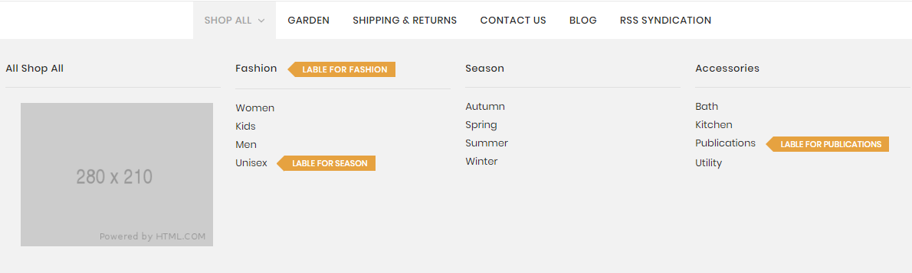
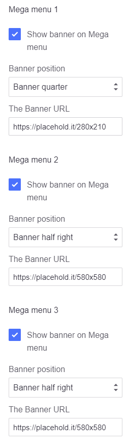
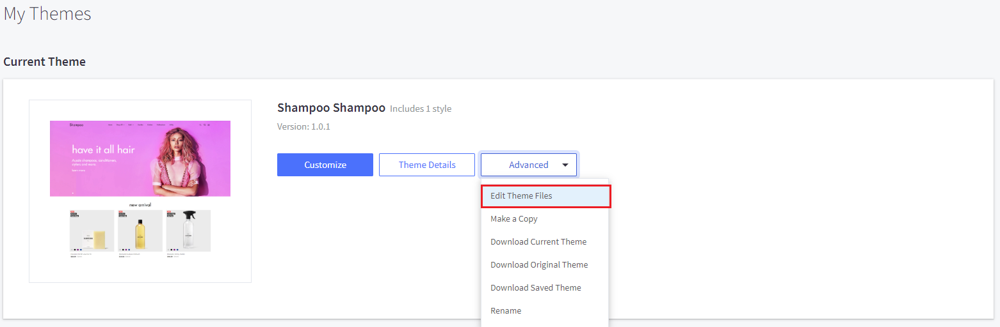
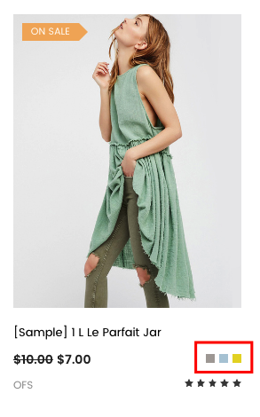

# Customization

This page will explain all configuration available and how to edit each section appear on theme. Let's view the first homepage.


## Top Banner


The top banner can be showed / edited in admin page > __Marketing__ > __Banners__. When you add / edit remember to choose __Location__ is __Top of Page__.

### Colors Customization

To customize colors of this section, go to admin page > __Storefront Design__ > __My Themes__, click button __Customize__ of the current theme to open the Theme Editor. 


Look into the options showing below:


## Header

### Header Styles
This theme support 3 different header styles:
- Logo at left
- Logo at right
- Logo at center


To configure, open the __Theme Editor__, scroll down to section __Logo__, click to expand the logo options. Choose a certain option of __Logo position__, then click __Refresh__ button appear after.


### Edit 3 info text blocks


Show, hide and Edit content these text blocks in Theme Editor > __Header__ section as showing below: 


### User navigation Customization

To customize User navigation of the header section, look into the options showing below in the Theme Editor:


### Page navigation Customization

To customize Page navigation of the header section, look into the options showing below in the Theme Editor:


### Mega menu Customization


The theme support 6 Megamenu.
To customize Mega menu of the header section, look into the options showing below in the Theme Editor:



- __Show banner on Mega menu__: Check it if you want to display the banner in this Megamenu.
- __Banner position__: There are 3 choices: __Banner half left__, __Banner half right__ and __Banner quarter__.
- __The Banner URL__: Enter the path of image source.

If you want to show a label beside a menu items like above image, for example the menu item Season has category ID = `24`:

- __Id Mega menu item__: Is category ID `24`.
- __Show label on This menu item__: Check it if you want to display the label in this Megamenu.
- __Label text of This Mega menu item__: is the label text .


## Main Slideshow / Carousel

### Edit the slideshow

Edit the slideshow in admin page > __Storefront Design__ > __Design Options__:


### Change position of text content

The theme supports showing slideshow content like heading, text, button on __left__, __right__ or __center__ of the image. To configure this option, open Theme Editor, Look into section Carousel, click to expand:


Choose position of each slide you want to change.

### Colors Customization

To customize color of the slideshow's elements, look into section __Carousel__ in the Theme Editor:


### Hide the slideshow

To hide the slideshow on homepage, uncheck on the checkbox __Show Carousel__ in section __Carousel__ of the Theme Editor.


## Style 1 / 3 Banners


To edit content and images of banners, Open the link below on your web browser: [https://bc-laparis-builder.papathemes.com/](https://bc-laparis-builder.papathemes.com/)

Chooes the tab __Style 1 / 3 Banners__ and Enter all required info on the form.


- Create a new banner in __Marketing__ > __Banners__ > click __Create a Banner__ button.
- Click button __HTML__ in __Banner Content__ editor to show __HTML Source Editor__.
- Copy and paste the code above to __HTML Source Editor__. Then click __Update__ button:


Set Show on __Page = Home Page__ and __Location = Top of Page__:


## Style 1 / New - Featured - Popular Products

The theme supports 3 layout type of New Products, Featured Products and Popular Products blocks:

__Grid__:


__List__:


__Carousel__:


## Style 2 / Image Slider


To edit images of Slider, Open the link below on your web browser: [https://bc-laparis-builder.papathemes.com/](https://bc-laparis-builder.papathemes.com/)

Chooes the tab __Style 2 / Image__ Slider and Enter all required info on the form.


- Create a new banner in __Marketing__ > __Banners__ > click __Create a Banner__ button.
- Click button __HTML__ in __Banner Content__ editor to show __HTML Source Editor__.
- Copy and paste the code above to __HTML Source Editor__. Then click __Update__ button:


Set Show on __Page = Home Page__ and __Location = Top of Page__:


## Style 2 / Products By Category


This section allows you to show products in a certain category. To configure it in the Hompage section.


- __Category Id__: is the product category ID that products belong.
- __Banner position__: __left__ or __right__ to show banner on left or right.
- __Banner URL__: is the image URL to show up beside the products.
- __Heading__: The heading text on the banner beside.
- __Subheading__: Description text on the banner beside.
- __Button text__: Button text on the banner beside

Theme supports up to 3 products by category blocks.

## Style 2 / New - Featured - Bestselling Columns


This section show new products, featured products and bestselling products in 3 columns.

You can configure number of products to display in __Theme Editor__ > __Homepage__ section:


## Style 3 / First Row Banners


To edit images of Banners, Open the link below on your web browser: [https://bc-laparis-builder.papathemes.com/](https://bc-laparis-builder.papathemes.com/)

Chooes the tab __Style 3 / First Row Banners__ and Enter all required info on the form.


- Create a new banner in __Marketing__ > __Banners__ > click __Create a Banner__ button.
- Click button __HTML__ in __Banner Content__ editor to show __HTML Source Editor__.
- Copy and paste the code above to __HTML Source Editor__. Then click __Update__ button:


Set Show on __Page = Home Page__ and __Location = Top of Page__:


## Style 3 / Second Row Banners


To edit images of Banners, Open the link below on your web browser: [https://bc-laparis-builder.papathemes.com/](https://bc-laparis-builder.papathemes.com/)

Chooes the tab __Style 3 / Second Row Banners__ and Enter all required info on the form.


- Create a new banner in __Marketing__ > __Banners__ > click __Create a Banner__ button.
- Click button __HTML__ in __Banner Content__ editor to show __HTML Source Editor__.
- Copy and paste the code above to __HTML Source Editor__. Then click __Update__ button:


Set Show on __Page = Home Page__ and __Location = Top of Page__:


## Style 3 / Third Row Banners


To edit images of Banners, Open the link below on your web browser: [https://bc-laparis-builder.papathemes.com/](https://bc-laparis-builder.papathemes.com/)

Chooes the tab __Style 3 / Third Row Banners__ and Enter all required info on the form.


- Create a new banner in __Marketing__ > __Banners__ > click __Create a Banner__ button.
- Click button __HTML__ in __Banner Content__ editor to show __HTML Source Editor__.
- Copy and paste the code above to __HTML Source Editor__. Then click __Update__ button:


Set Show on __Page = Home Page__ and __Location = Top of Page__:


## Style 4 / Text Block


To edit content of Text Block, Open the link below on your web browser: [https://bc-laparis-builder.papathemes.com/](https://bc-laparis-builder.papathemes.com/)

Chooes the tab __Style 4 / Text Block__ and Enter all required info on the form.


- Create a new banner in __Marketing__ > __Banners__ > click __Create a Banner__ button.
- Click button __HTML__ in __Banner Content__ editor to show __HTML Source Editor__.
- Copy and paste the code above to __HTML Source Editor__. Then click __Update__ button:


Set Show on __Page = Home Page__ and __Location = Top of Page__:


## Style 4 / First Row Banners


To edit images of Banners, Open the link below on your web browser: [https://bc-laparis-builder.papathemes.com/](https://bc-laparis-builder.papathemes.com/)

Chooes the tab __Style 4 / First Row Banners__ and Enter all required info on the form.


- Create a new banner in __Marketing__ > __Banners__ > click __Create a Banner__ button.
- Click button __HTML__ in __Banner Content__ editor to show __HTML Source Editor__.
- Copy and paste the code above to __HTML Source Editor__. Then click __Update__ button:


Set Show on __Page = Home Page__ and __Location = Top of Page__:


## Style 4 / Second Row Banners


To edit images of Banners, Open the link below on your web browser: [https://bc-laparis-builder.papathemes.com/](https://bc-laparis-builder.papathemes.com/)

Chooes the tab __Style 4 / Second Row Banners__ and Enter all required info on the form.


- Create a new banner in __Marketing__ > __Banners__ > click __Create a Banner__ button.
- Click button __HTML__ in __Banner Content__ editor to show __HTML Source Editor__.
- Copy and paste the code above to __HTML Source Editor__. Then click __Update__ button:


Set Show on __Page = Home Page__ and __Location = Top of Page__:


## Style 4 / Third Row Banners


To edit images of Banners, Open the link below on your web browser: [https://bc-laparis-builder.papathemes.com/](https://bc-laparis-builder.papathemes.com/)

Chooes the tab __Style 4 / Third Row Banners__ and Enter all required info on the form.


- Create a new banner in __Marketing__ > __Banners__ > click __Create a Banner__ button.
- Click button __HTML__ in __Banner Content__ editor to show __HTML Source Editor__.
- Copy and paste the code above to __HTML Source Editor__. Then click __Update__ button:


Set Show on __Page = Home Page__ and __Location = Top of Page__:


## Style 4 / Fourth Row Banners


To edit images of Banners, Open the link below on your web browser: [https://bc-laparis-builder.papathemes.com/](https://bc-laparis-builder.papathemes.com/)

Chooes the tab __Style 4 / Fourth Row Banners__ and Enter all required info on the form.


- Create a new banner in __Marketing__ > __Banners__ > click __Create a Banner__ button.
- Click button __HTML__ in __Banner Content__ editor to show __HTML Source Editor__.
- Copy and paste the code above to __HTML Source Editor__. Then click __Update__ button:


Set Show on __Page = Home Page__ and __Location = Top of Page__:


## Style 4 / Fifth Row Banners


To edit images of Banners, Open the link below on your web browser: [https://bc-laparis-builder.papathemes.com/](https://bc-laparis-builder.papathemes.com/)

Chooes the tab __Style 4 / Fifth Row Banners__ and Enter all required info on the form.


- Create a new banner in __Marketing__ > __Banners__ > click __Create a Banner__ button.
- Click button __HTML__ in __Banner Content__ editor to show __HTML Source Editor__.
- Copy and paste the code above to __HTML Source Editor__. Then click __Update__ button:


Set Show on __Page = Home Page__ and __Location = Top of Page__:


## Style 4 / Video Banner


To edit content of Video Banner, Open the link below on your web browser: [https://bc-laparis-builder.papathemes.com/](https://bc-laparis-builder.papathemes.com/)

Chooes the tab __Style 4 / Video Banner__ and Enter all required info on the form.


- Create a new banner in __Marketing__ > __Banners__ > click __Create a Banner__ button.
- Click button __HTML__ in __Banner Content__ editor to show __HTML Source Editor__.
- Copy and paste the code above to __HTML Source Editor__. Then click __Update__ button:


Set Show on __Page = Home Page__ and __Location = Top of Page__:


### Show/Hide Quickview button

When hover on a product item, Quickview button is showed up by default. To disable this feature, uncheck the checkbox __Show Quickview__ in the __Theme Editor__ > __Products__ section.


### Change colors and image sizes

In the __Theme Editor__ > __Products__ section, Look into the color options below __Product cards__, __Product Sale Badges__, __Product cards (Quick search)__ and __Image sizes__'s options.


###Change background of featured products block


#### METHOD 1:
To replace this background with our own image, in [Edit Theme Files](https://tvlgiao.github.io/bc-laparis-docs/quickstart/index.html#edit-template-files) you can overwrite image file  `assets/img/categories-featured-bg.jpg` with your own.

#### METHOD 2:
To completely remove it, add the CSS code below to `assets/scss/_theme-custom.scss`:

```plain
.emthemesModez-productsVerticalCategoriesAside-outer--1 {
  background-image: none;
}
```

### Show products grid with first product show bigger
In theme __Style 3__, the homepage shows new products like below:


This can be accomplished by the code in homepage template file  `templates/components/emthemes-modez/home/laparis3.html`:
```plain
{{> components/emthemes-modez/sections/section section="new_products" style="laparis1"}}
```
Note the difference is `style="laparis1"`.

Show products carousel fullwidth and having subheading
In theme style LaParis IV, the homepage shows featured products like below:


This can be accomplished by the code in homepage template file  `templates/components/emthemes-modez/home/laparis4.html`:
```plain
{{> components/emthemes-modez/sections/section section="featured_products" style="laparis4" show_subheading=true}}
```
- `style="laparis4"` indicates that products carousel should show full width.
- `show_subheading=true` indicates that the products block should have subheading.
Subheading can be edited in __Homepage Section__:


## Recent Blog Posts


This block show the most recent blog posts.

### Customize heading text and other text

To change the heading text, read more text and date format, edit in The Blog section. Edit its values as you want.


## Brand Carousel


To edit images of Brand Carousel, Open the link below on your web browser: [https://bc-laparis-builder.papathemes.com/](https://bc-laparis-builder.papathemes.com/)

Chooes the tab __Brand Carousel__ and Enter all required info on the form.


- Create a new banner in __Marketing__ > __Banners__ > click __Create a Banner__ button.
- Click button __HTML__ in __Banner Content__ editor to show __HTML Source Editor__.
- Copy and paste the code above to __HTML Source Editor__. Then click __Update__ button:


Set Show on __Page = Home Page__ and __Location = Top of Page__:


## Instagram Photos


### Get your own User ID, Client ID, Access Token

In order to display your Instagram photos on your website, you will need to get the __User ID__, __Client ID__ and __Access Token__ from __Instagram Developer__ portal.

#### 1. Create your own Client ID

Open the URL <https://www.instagram.com/developer/> in your browser.

Login to your Instagram account.

Click button __Register Your Application__: 


Click button __Register a New Client__: 


Enter all required info on the form. 


Note that __Valid redirect URIs__ should be exactly `http://127.0.0.1` as recommended as it will be used in the next step.

After submitting the form you will get back to the previous page with a new __Client ID__ is created.


Save this __Client ID__ value, it will be used to configure the Instagram Photos block.

#### 2. Retrieve your Access Token

Click button __Manage__ on your the client app created previously. Open __Security__ tab, uncheck __Disable Implicit OAuth__ checkbox:


Click __Update Client__ button to complete.

Now open your web browser with the URL: 

```plain
https://api.instagram.com/oauth/authorize/?client_id=CLIENT-ID&redirect_uri=http://127.0.0.1&response_type=token
```

where `CLIENT-ID` is replaced by your __Client ID__ number created previously.

Click __Authorize__ button to grant access permission:


Instagram will redirect you to an error page with the URL similiar: 


The text after `access_token=` is the __Access Token__ you want to get. Save it for the next step.

#### 3. Retrieve your User ID

Open the link below on your web browser:

```plain
https://api.instagram.com/v1/users/self/?access_token=ACCESS-TOKEN
```
Where `ACCESS-TOKEN` is replaced by your real __Access Token__ just received previously.


The number in `"id": "..."` is your __User ID__.

### Display your Instagram photos

To display our own Instagram photos, in the Instagram section. input your real code:

- `user_id`: Is your Instagram __User ID__.
- `client_id`: is your Instagram __Client ID__.
- `access_token`: is your Instagram __Access Token__.
- `title`: Is the heading text.
- `description`: Is the heading text.


## Footer - Newsletter


### Change text

To change text appear on this section you can edit the language file as instruction below:

From admin page > __Storefront Design__ > __My Themes__, click button __Advanced__ > __Edit Theme Files__ of the current theme:



From the left navigation, click to edit the language file (e.i `en.json`):


See the section `Newsletter` you can edit as you want:


### Colors Customization

To customize colors of the header section, look into the options showing below in the __Theme Editor__ > __Footer__:


## Footer - Links


To edit text and links on the footer, To edit Footer Links, You Go to __Theme Editor__ > __Footer__:


- __Footer links column 1 heading__, __Footer links column 2 heading__, __Footer links column 3 heading__: is the heading text of each column.
- __Footer links column * title__, __Footer links column * url __: is URL and text of each link.


## Social Media Icons


To show social icons in the footer, open __Theme Editor__ > __Social Media Icons__ section, set __Bottom Placement__ = `Right`. 

Note: You will need to configure which icons to appear in admin panel > __Storefront Design__ > __Design Options__, input your social links in __Social Media__ section.


## Payment Icons


To show/hide payment icons, go to Theme __Editor__ > __Payment Icons__ secitons, check or uncheck any icons you want to show or hide.


## Copyright Links


To edit links in the copyright section at footer, To edit Copyright Links, You Go to the __Theme Editor__ > __Footer__:


- `url*` is link URL. Leave a blank if you want to hide any link.
- `title*` is link title.


## Credit Links


To show/hide the credit links, go to Theme Editor > __Footer__ section, tick or untick the checkboxes as showing above.


## Assign different product layout to a specific product page

Theme has 2 product layouts: __default__ and __Fullwith with Lightbox__.

Product layout fullwidth:


To assign a product layout, edit your product in the admin panel. In tab __Order Details__, choose __Template Layout File__ with the layout out want:


## Assign different category layout to a specific category page

Theme has 2 category layout: __default__ and __Fullwidth__.

Category layout fullwidth:


To assign a category layout, edit your category in the admin panel. Choose __Template Layout File__ with the layout out want:


## Show custom product labels


Turn on displaying product labels in the __Theme Editor__ > __Products section__, tick on the checkbox __Show custom label using custom field 'card_label'__ and __choose Display Product Sale Badges__ as __Top Left__.


Edit your product in the admin panel to add custom label:


Add a custom label named `card_label` and enter label text in the value input box.

## Show color swatches on product card:



To display color watches on product card, open __Theme Editor__ > __Products section__, tick on the checkbox __Show color swatches using custom field 'card_color'__.


Edit your product in the admin panel to add custom label:


Add a custom label named `card_color` and enter color hex code in the value input box seperator by commas.

## Add our own CSS (Sass) code

To add your own custom CSS code you can edit the file `assets/scss/_theme-custom.scss_` in __Edit Theme Files__ editor:


__Note: __

- Copy / backup this file for future theme upgrade.
- Add custom CSS code required CSS (or Sass) programming skill. It's not recommended for new users.
